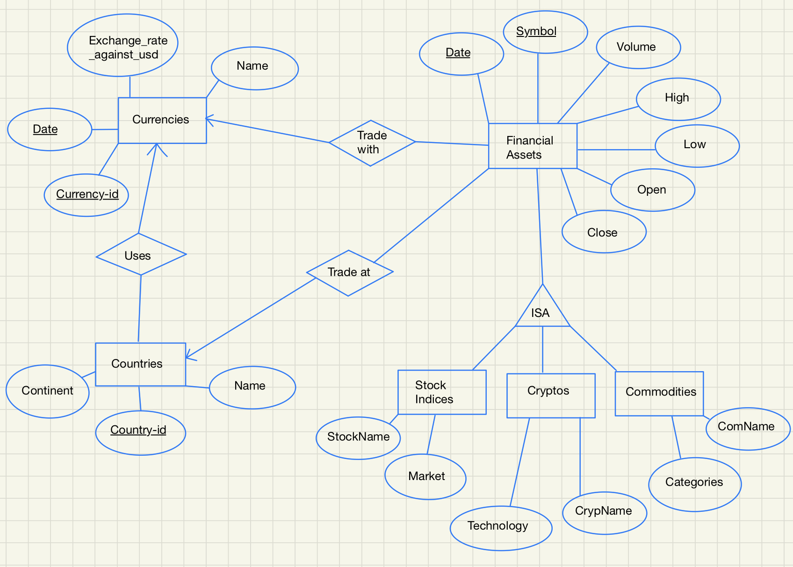

## Historical Comparison of Major Global Investments

This is the repository for CS 564 Summer 2022 final group project. 

The project is a database system that preserves the historical data of couple global investments, including **Stocks, Cryptocurrencies, Commodities, and Forex Tradings.** Details of this project will be filled as progress are made in the future.

- To connect this application to your database, please open `main.py` and go to line `9` to find `db = mysql.connector.connect(host = "localhost", user = "root", password = "A1b2C3d4&", db ="564project")` and replace parameters to connect your own db.
- To run this application, connect db and run `main.py`.

## UPDATE NOTICES:
- **7.27**: stock_merged.csv have format errors: need to clear whitespaces in first col (Symbol)
- **7.27**: special character need to escape ('.'; '=') NOT ABLE TO SEARCH
- **7.27**: crypto lack of **meta data**
- **7.27**: foreign currency dataset cleansing **still NEEDED**
- **8.2**： `./sql` folder contains initialization & stored procedure querys used for final project
- **8.3**: placeholder

## ER Diagram
Below is the ER diagram of our projects

## Remaining Key Deadlines
| Task | Deadline
| --- | ---
| Checkpoint 2 | 7.3
| Midterm EXAM | 7.7
| Checkpoint 3 | 7.21
| Checkpoint 4 | 7.25
| Project - Group Presentation | 8.3
| Last day of class | 8.3
| Final Exam | 8.7

## Checkpoint documents:
- [CheckPoint 1](https://docs.google.com/document/d/19wpiX-QRu7TO3zOWY4xtz111-e6vxOtdY4rdUp3xhbU/edit)
- [CheckPoint 2](https://docs.google.com/document/d/1QbvbhLX564RaR9m_v-PTcX7WhtSXg4a_W4x0iucWMlI/edit)
- [CheckPoint 3](https://github.com/jsswd888/cs564_Final_Project_CheckPoint3)
- [CheckPoint 4](https://docs.google.com/document/d/1N3F4TwZBfhCbsuFdNF103-FF0YPYEK1w4IMO-66yY7g/edit)
  
**NOTE** that check point 3 is a coding section, which includes the implementation of **B+ Trees** in `java`.

## Contact
Please contact any of our group members if you have further concerns: 
- [Shi, Kaiwen](mailto:kshi42@wisc.edu)
- [Yu, Xizheng](mailto:xyu354@wisc.edu) 
- [Xing, Yu](mailto:xing35@wisc.edu)

## References
- https://stackoverflow.com/questions/18992653/entity-relationship-diagram-how-does-the-is-a-relationship-translate-into-table
- 3NF decompose algorithm - http://functionaldependencycalculator.ml/algorithm/7
