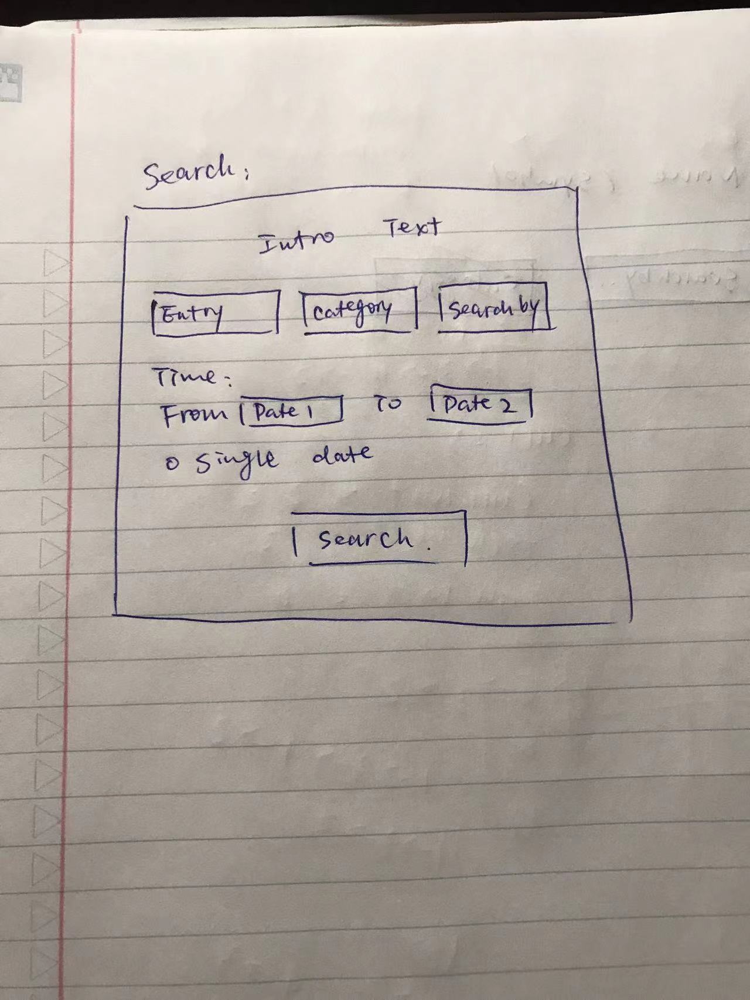
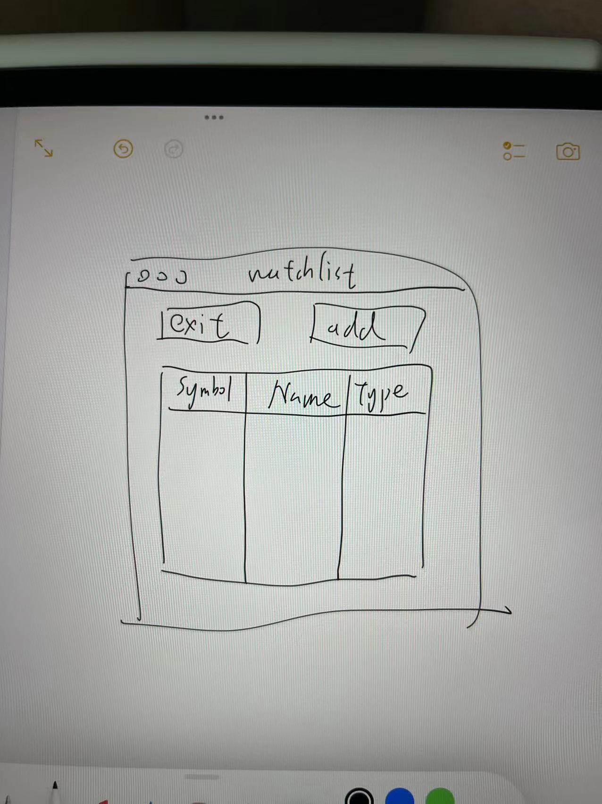

# NOTE about this file directory

## `calendar.py`
currently not used; possibly to be used if need a visualized "date" selection function

## `search.py`
The basic GUI figure follows this image design below:

Blueprint as shown

## `watchlists.py`

Blueprint as shown
